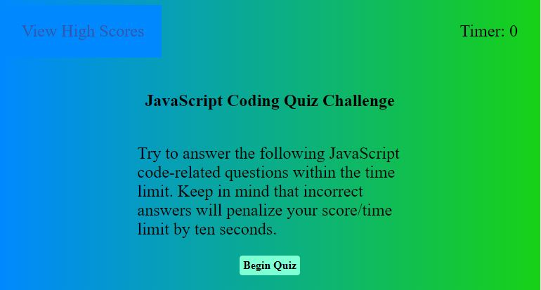

# Javascript Code Quiz Webpage

## Description

My motivation to buid this project was so that I could acquire practice with writing HTML, mobile-responsive CSS, and JavaScript logic all in one application.  I built this project to make a fun quiz game that students could use to review some basic JavaScript concepts.  This project solves the problem of students needing a fun way to brush up on some beginner JavaScript syntax.  In this project, I learned about event listeners and how to use them to listen for events on a webpage, such as mouse clicks.  I also learned a little bit about writing lambda expressions with JavaScript.  For this project, I used JavaScript to ask the user questions and then provide potential answers.  The questions are randomly chosen from a question pool.  I also gave the user the ability to save his or her scores on the local machine, and then delete those scores if he or she wishes.

## Table of Contents (Optional)

This README isn't that long, so N/A.

## Installation

N/A

## Usage

To use the quiz webpage, go to the link below.  Click the "Begin Quiz" button to start the quiz.  The computer will ask a series of 10 questions with four answer choices per question.  The user has a total of 75 seconds to answer all 10 questions, but an incorrect answer will take 10 seconds away from the remaining time.  Once the quiz is complete, after all 10 questions have been answered, and/or the timer expires, the user will be prompted to enter his or her initials, which must be entered as alphabetical characters.  Once the user submits his or her initials, the system will display those initials with the score on the screen, along with any other score-and-initial pairs that are currently saved to the system.  From there the user can click "Go Back" to go back to the starting point, where he or she can then begin a new quiz.   After submitting his or her score, the user can also click "Clear High Scores", which will remove the high scores from the system's storage.  The user can also click the "View High Scores" button in the top right corner of the screen, which will display the high scores.  If there aren't any saved scores when the system goes to display the scoreboard, the system will indicate this via text.

Here is a link to the deployed JavaScript quiz webpage: [https://theboss1485.github.io/javascript-code-quiz-webpage/](https://theboss1485.github.io/javascript-code-quiz-webpage/)

Here is a screenshot of the webpage: 

## Credits

I didn't have any human collaborators on this project.  However, I did use OSU's Xpert Learning Assistant AI Chatbot to help out with a couple of pieces of code.

## License

This project is under an MIT license.  Please see the license in the GitHub repository for more information.

## Badges

I don't have any badges to display.

## Features

This project is a webpage that asks the user a series of JavaScript questions from a slightly larger question pool.  The project gives users the ability to save their scores in local storage, and thus have them persist across browser tabs and sessions.  Users can also delete their saved scores if they so desire.

## How to Contribute

This was an assignment that I personally completed, so N/A.

## Tests

N/A